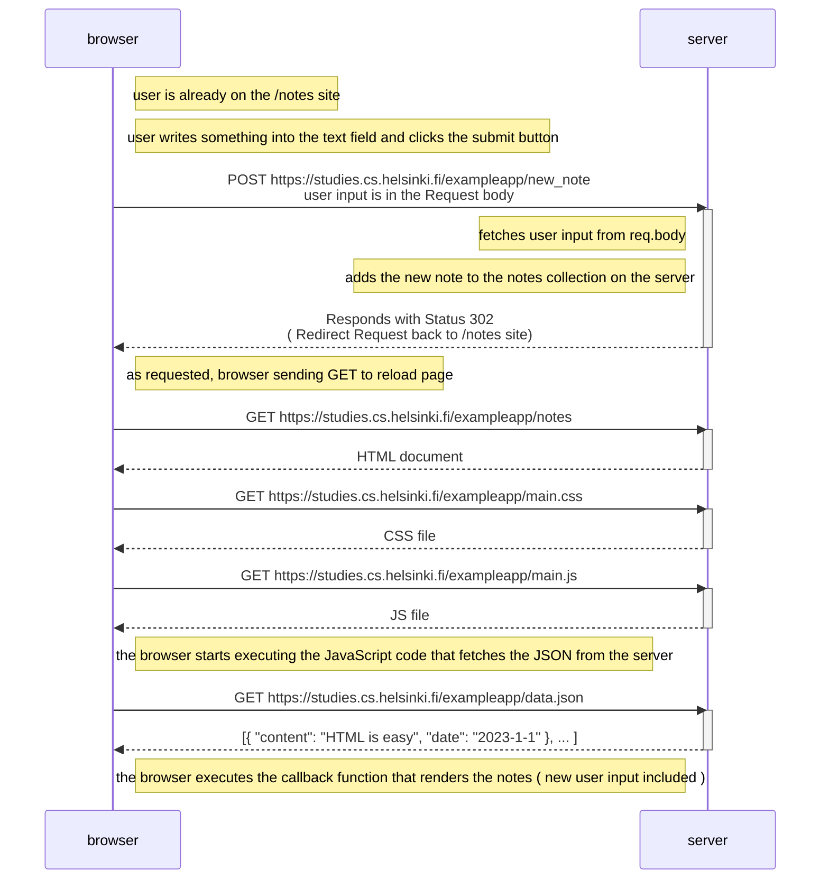
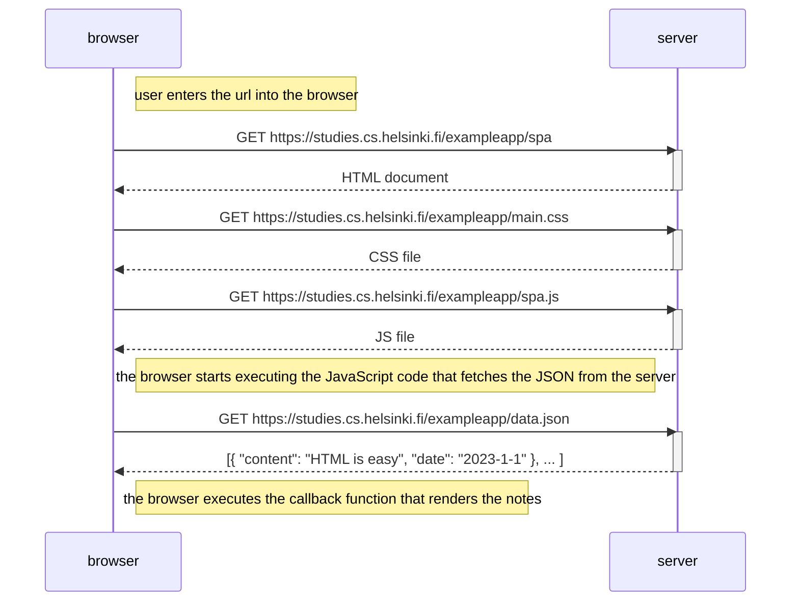
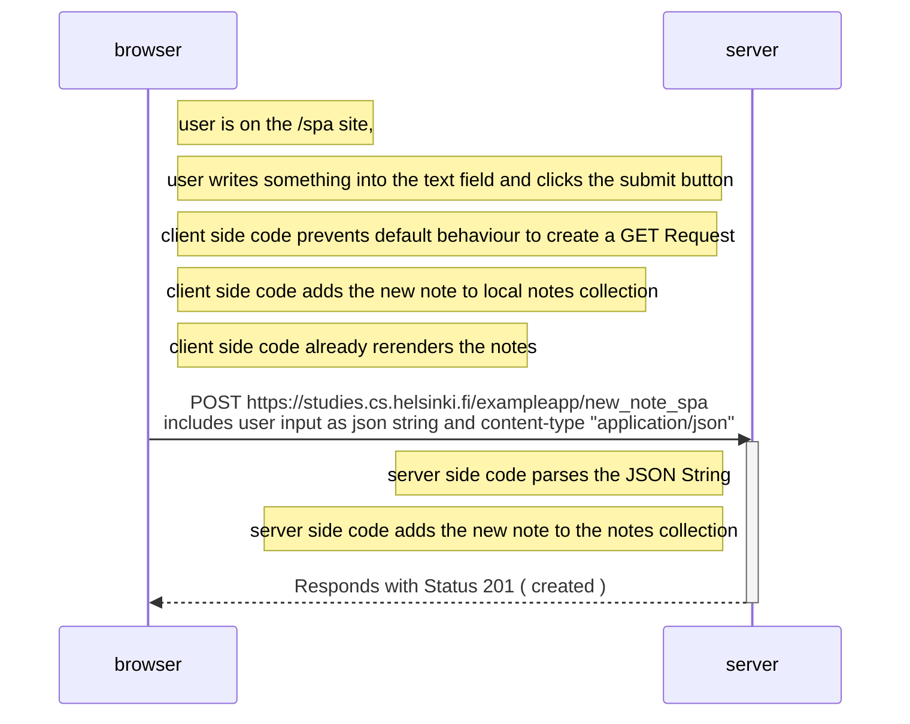

# Exercise 0.4:
Create a similar diagram depicting the situation where the user creates a new note on the page https://studies.cs.helsinki.fi/exampleapp/notes by writing something into the text field and clicking the submit button.

If necessary, show operations on the browser or on the server as comments on the diagram.

## Sequence diagram

# Exercise 0.5:
Create a diagram depicting the situation where the user goes to the single-page app version of the notes app at https://studies.cs.helsinki.fi/exampleapp/spa.

## Sequence diagram

# Exercise 0.6:
Create a diagram depicting the situation where the user creates a new note using the single-page version of the app.

## Sequence diagram

